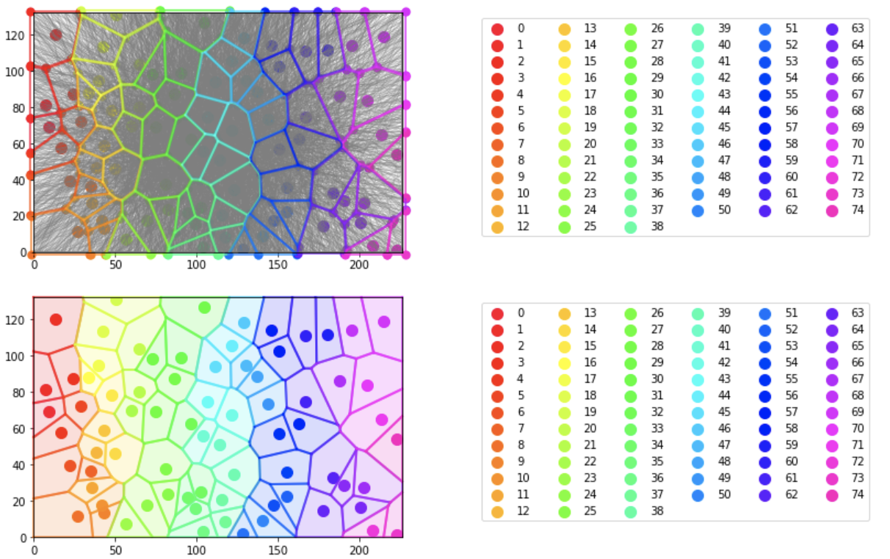
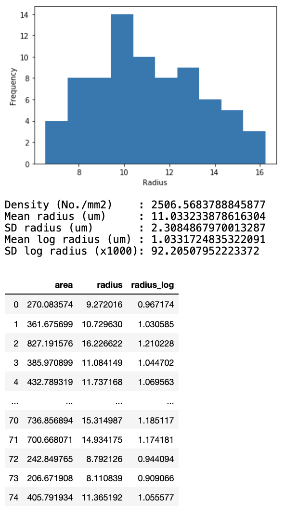

# capillary-domain
 
Plot capillary domains and calculate areas based on their coordinates.
 
# DEMO
 

  
# Requirement

* numpy
* matplotlib
* pandas
 
# Note
 
Algorithm for removing duplicate intersections is not perfect.

# Reference

Hoofd L et al. Adv Exp Med Biol. 1985;191:239-47
